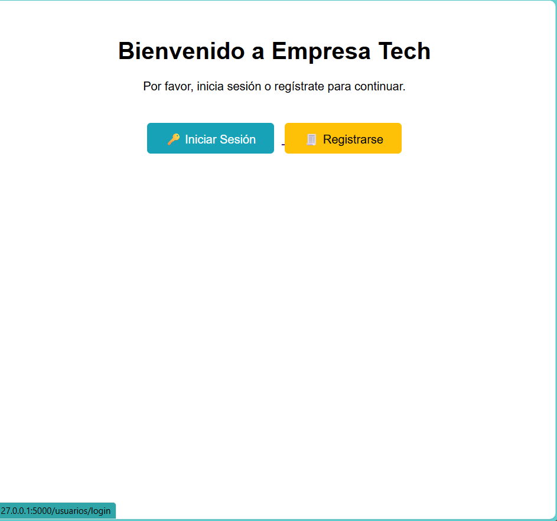
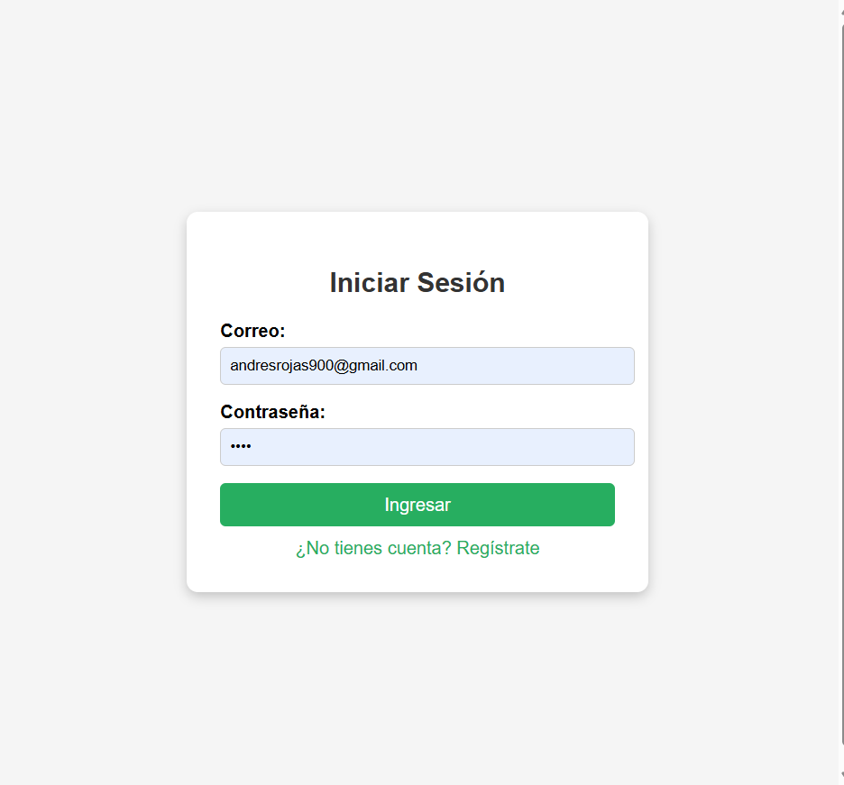
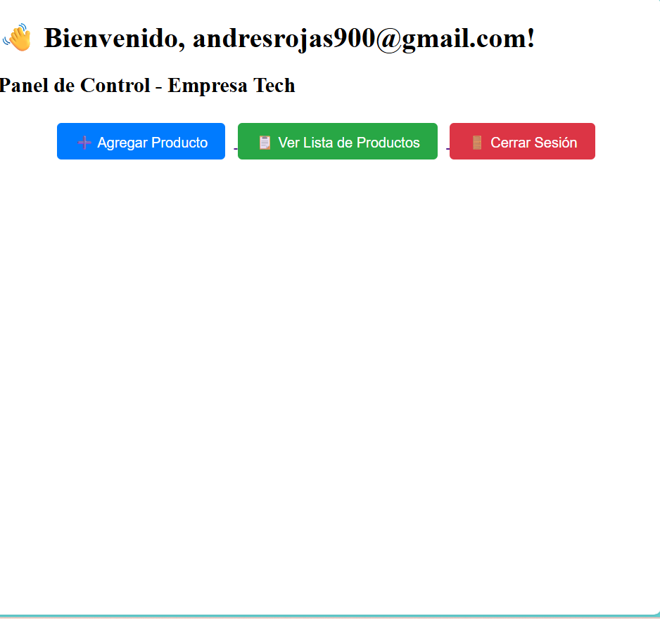
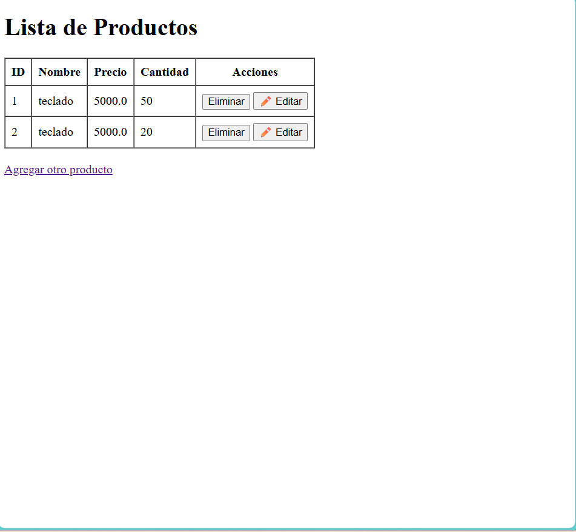
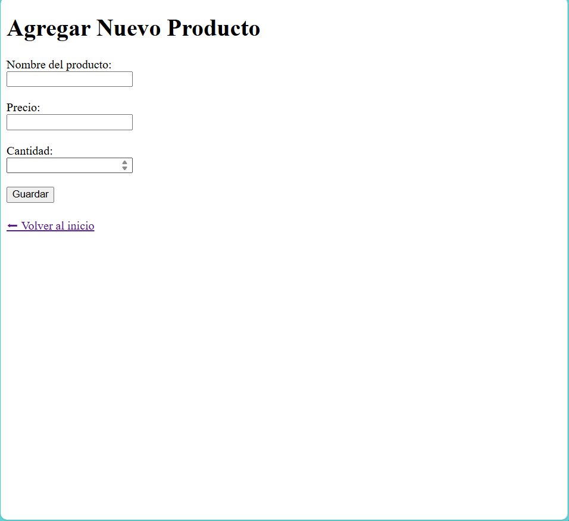

🏢 CRUD_EMPRESA_TECH
🧩 Descripción del Proyecto

CRUD_EMPRESA_TECH es una aplicación web desarrollada con Flask y SQLite que permite la gestión completa de productos y usuarios.
Cuenta con un sistema de registro, inicio de sesión y panel de control donde los usuarios pueden agregar, editar, listar y eliminar productos fácilmente.

El objetivo del proyecto es aplicar los fundamentos de Flask, SQLite, Blueprints y sesiones de usuario, simulando un entorno real de empresa tecnológica.

🚀 Tecnologías Utilizadas

🐍 Python 3.13

🌶️ Flask

💾 SQLite

🎨 HTML5 + CSS3 (Bootstrap)

⚙️ Git & GitHub

🧱 Estructura del Proyecto
empresa_tech/
│
├── app.py
├── config.py
├── db.py
├── productos.db
│
├── inventario/
│   ├── __init__.py
│   └── routes.py
│
├── usuarios/
│   ├── __init__.py
│   └── routes.py
│
├── static/
│   └── css/
│       └── styles.css
│
├── templates/
│   ├── index.html
│   ├── inventario/
│   │   ├── agregar_producto.html
│   │   ├── editar.html
│   │   └── lista.html
│   └── usuarios/
│       ├── login.html
│       ├── registro.html
│       └── dashboard.html
│
└── README.md

🧠 Funcionalidades Principales

✅ Registro e inicio de sesión de usuarios
✅ Panel de control personalizado con sesión activa
✅ CRUD completo de productos (crear, listar, editar, eliminar)
✅ Base de datos persistente con SQLite
✅ Diseño moderno, limpio y responsivo
✅ Rutas organizadas con Blueprints

🖥️ Capturas del Proyecto

📌 Aquí puedes insertar las imágenes del funcionamiento del CRUD, login y dashboard.

Vista	Imagen
Login	

Dashboard	

Lista de Productos	

(Crea una carpeta static/img/ y guarda allí las capturas para que se muestren en GitHub)

⚙️ Cómo Ejecutarlo Localmente

1️⃣ Clona el repositorio

git clone https://github.com/Arock900/CRUD_EMPRESA_TECH.git
cd CRUD_EMPRESA_TECH

2️⃣ Instala las dependencias necesarias

pip install flask

3️⃣ Ejecuta la aplicación

python app.py

4️⃣ Abre el navegador y visita

http://127.0.0.1:5000/

👨‍💻 Autor

Andrés Rojas (@Arock900)
Desarrollador en formación, enfocado en backend y aplicaciones web con Python.
📅 Proyecto realizado en 2025 como parte del aprendizaje de Flask + SQLite.

🧾 Licencia

Este proyecto es de uso libre para fines educativos.
© 2025 Andrés Rojas — Todos los derechos reservados.